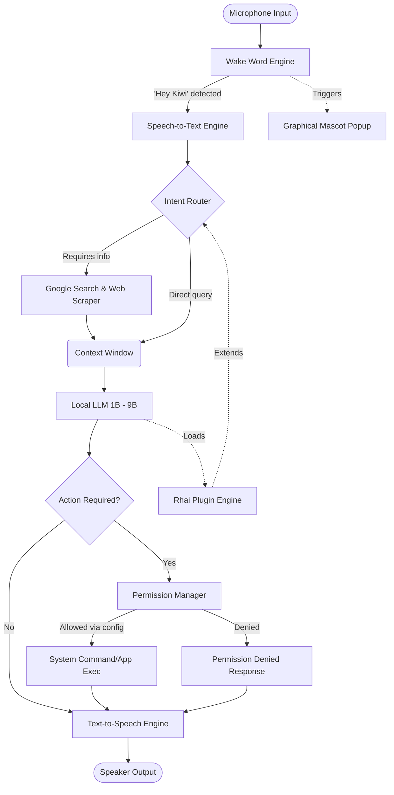

# Kiwi Architecture 🦜

This document outlines the high-level architecture and key design decisions for Kiwi, the local AI desktop assistant.

## High-Level Architecture

Kiwi operates entirely locally, utilizing a modular pipeline for audio processing, language modeling, and execution. Below is a Mermaid.js diagram illustrating the core flow of data through the system.

## Key Design Decisions

### 1. Language: Rust
**Why Rust?**
Kiwi is designed to be a lightweight background daemon. Rust provides the perfect balance of low-level control (necessary for audio stream processing and system interactions), high performance (crucial for running LLMs efficiently on consumer hardware), and memory safety.

### 2. Plugin System: Rhai
**Why Rhai?**
We want developers to easily extend Kiwi's capabilities without having to recompile the entire core application. [Rhai](https://rhai.rs/) is an embedded scripting language specifically designed for Rust. It is fast, safe, and easily binds to Rust functions, making it the ideal choice for user-defined scripts and plugins.

### 3. Permission Management
**Configuration-driven Security**
Because Kiwi runs locally and has the potential to execute system commands, security is paramount. Kiwi uses a strict, whitelist-based configuration file (`permissions.toml`). The assistant cannot execute any shell commands, open apps, or read/write files unless explicitly permitted by the user in this configuration file (e.g., allowing specific wildcard patterns like `git *`).

### 4. Local-First AI
**Privacy & Independence**
The core intelligence relies on small, quantized LLMs (ranging from 1B to 9B parameters) running entirely on the user's machine. This guarantees that private conversations are never sent to external servers, while still providing robust natural language understanding.

### 5. Web Search Integration
**Bridging the Knowledge Gap**
While local LLMs are great, their knowledge cutoff limits their ability to answer queries about current events. Kiwi is designed to seamlessly fall back to Google Search and web scraping when the LLM determines that real-time information is required to satisfy the user's prompt.